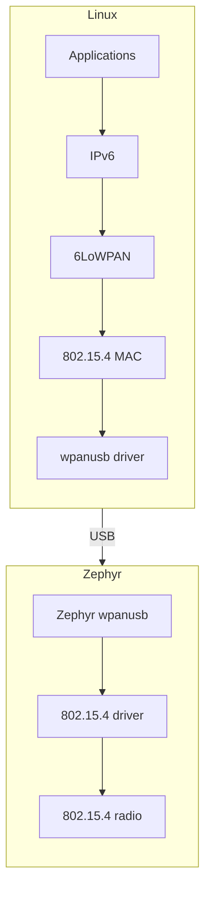

WPANUSB
=======

Overview
--------

wpanusb is a Linux kernel driver for wpanusb 802.15.4 USB dongle.
The big picture is shown below:



Please note that there are 2 wpanusb in the picture:
- Linux kernel driver (driver) which is described here
- Zephyr application (firmware) which is described in
  [Zephyr samples/net/wpanusb](https://docs.zephyrproject.org/latest/samples/net/wpanusb/README.html)

For more information please see my presentation at Embedded Linux Conference Europe, 2019.
[Writing Your Own Gadget](https://static.sched.com/hosted_files/osseu19/6a/WYOG-eng-v15.pdf).

Prerequisites
-------------

- a hardware board with 802.15.4 radio and USB controller supported by Zephyr.
- Zephyr `wpanusb` application (firmware) is flashed to the board
- the board is connected to Linux via USB cable

Building Linux kernel wpanusb driver
------------------------------------

1. Make sure you have Linux kernel headers installed

```console
$ ls /lib/modules/`uname -r`/build
```

2. Type make, below is output for the latest Ubuntu

```console
$ make
make -C /lib/modules/`uname -r`/build M=$PWD
make[1]: Entering directory '/usr/src/linux-headers-4.4.0-38-generic'
  CC [M]  /usr/local/src/ieee802154/wpanusb/wpanusb.o
  Building modules, stage 2.
  MODPOST 1 modules
  CC      /usr/local/src/ieee802154/wpanusb/wpanusb.mod.o
  LD [M]  /usr/local/src/ieee802154/wpanusb/wpanusb.ko
make[1]: Leaving directory '/usr/src/linux-headers-4.4.0-38-generic'
```

Loading wpanusb
---------------

You can load driver with insmod given that all dependency are loaded, otherwise use
provided modprobe.sh script

```console
$ sudo scripts/modprobe.sh
```

wpan0 device should appear in the network devices list

Configuring 6lowpan address
---------------------------

There is a script helping to configure 6lowpan address

```console
$ sudo scripts/lowpan.sh
```

lowpan0 network device should appear and IPv6 address can be checked with

```console
$ ip addr show dev lowpan0
59: lowpan0: <BROADCAST,MULTICAST,UP,LOWER_UP> mtu 1280 qdisc noqueue state UNKNOWN group default qlen 1
    link/[825] 92:05:91:9b:5a:2c:34:41 brd ff:ff:ff:ff:ff:ff:ff:ff
    inet6 fe80::9005:919b:5a2c:3441/64 scope link
       valid_lft forever preferred_lft forever
```

There is link local IPv6 address which can be used for ping6.
